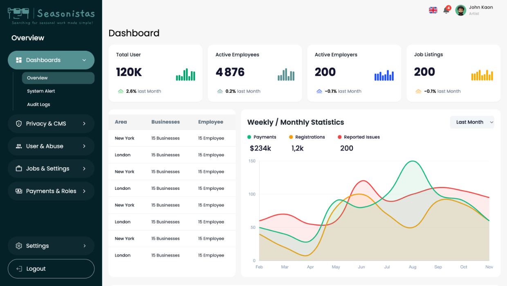
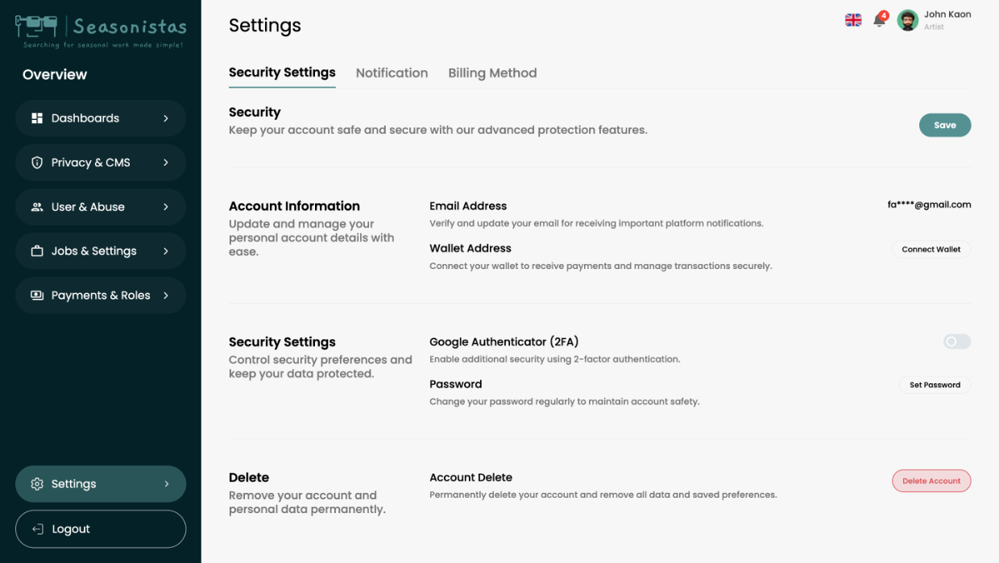
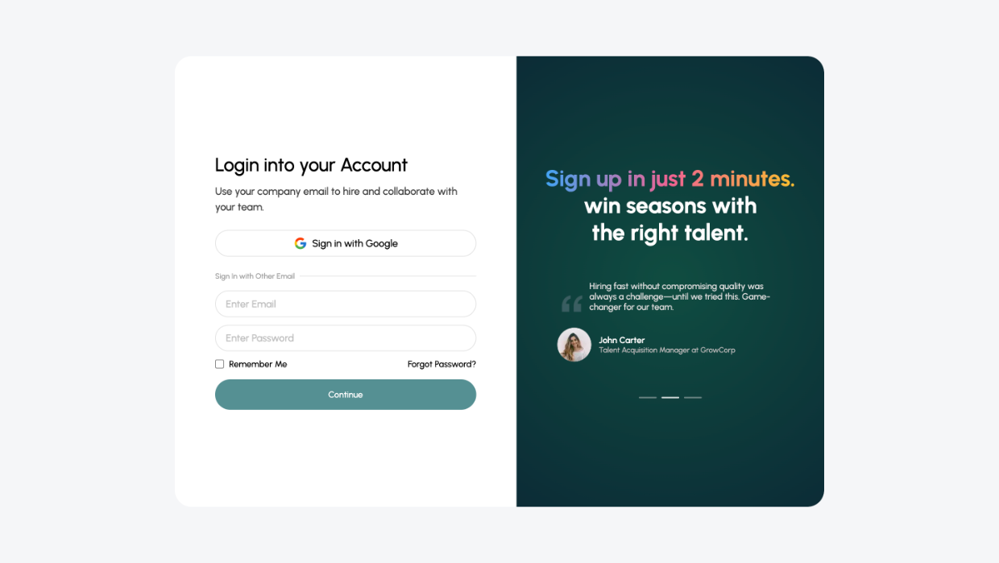

# Seasonistas Dashboard Frontend

A responsive dashboard frontend developed by **Softrare Labs** for **Seasonistas**, a seasonal work marketplace connecting employees and employers across Greece.

The dashboard experience was built to support employees, employers, and administrators with clean interfaces, reusable layouts, data visualization, and API-ready architecture for future platform integration.

---

## Project Overview

Seasonistas is a seasonal work marketplace designed to make hiring and job discovery more accessible, transparent, and efficient for Greece’s seasonal workforce.

Softrare Labs contributed to the platform by developing the dashboard frontend experience. The work focused on creating structured, responsive, and scalable dashboard interfaces for multiple user roles, including employees, employers, and admins.

> **Note:** This repository is used as a public project showcase. The full source code is not included due to client confidentiality, NDA, and intellectual property considerations.

---

## Goals & Challenge

The goal was to build a polished dashboard frontend that could support different user types while remaining responsive, maintainable, and ready for backend API integration.

Key objectives included:

- Develop dashboard interfaces for employees, employers, and admins.
- Create reusable components and scalable layouts.
- Maintain pixel-aligned implementation across screens.
- Support mobile, tablet, and desktop responsiveness.
- Add dynamic chart and analytics views for admin workflows.
- Use smooth transitions to improve dashboard usability.
- Prepare the frontend structure for backend API integration.
- Keep the interface clean, practical, and suitable for repeated daily use.

---

## Softrare Labs Solution

Softrare Labs developed a modern dashboard frontend using Next.js and Tailwind CSS, with structured layouts and reusable UI components for each dashboard role.

The admin experience includes chart-based data visualization, while the broader dashboard system was built with responsive navigation, settings screens, login flow, and API-ready page structures. The interface was designed for clarity, efficiency, and long-term maintainability.

---

## Key Features

- Responsive dashboard frontend
- Employee dashboard interface
- Employer dashboard interface
- Admin dashboard interface
- Reusable components and layouts
- API-ready frontend architecture
- Admin analytics and chart visualization
- Login page experience
- Settings dashboard screens
- Smooth animations and transitions
- Mobile-friendly dashboard layouts
- Pixel-aligned UI implementation
- Clean structure for future backend integration

---

## Tech Stack

- **Next.js 14** - React framework for scalable dashboard development
- **Tailwind CSS** - Utility-first responsive styling
- **Emotion React** - CSS-in-JS styling support
- **clsx** - Conditional class name utility
- **Framer Motion** - Smooth animations and UI transitions
- **Chart.js** - Dashboard charts and data visualization
- **date-fns** - Date formatting and utility functions

---

## Screenshots

### Admin Dashboard

A structured admin dashboard experience with visual data sections and management-focused layout.

### Settings Dashboard

A clean settings interface designed for account, profile, and platform configuration workflows.

### Login Screen

A responsive login experience designed as part of the dashboard access flow.

---

## Live Preview

Visit the live website:

[https://seasonistas.com/en](https://seasonistas.com/en)

---

## Outcome & Impact

The Seasonistas dashboard frontend provides a scalable user interface foundation for a multi-role job marketplace platform.

The project supports core dashboard workflows for employees, employers, and admins while maintaining responsive layouts, reusable components, and a clear structure for future backend integration.

---

## Privacy Notice

This is a private client project. The repository is intended only to showcase the project overview, design direction, technology stack, screenshots, and live website reference.

The full source code, private configuration, credentials, API logic, and implementation details are not publicly shared.

---

## About Softrare Labs

**Softrare Labs** is a web design and development agency helping businesses, organizations, and founders build modern, responsive, and high-performing websites.

We focus on clean design, reliable development, user experience, and launch-ready digital products for clients in the USA, Italy, Europe, and worldwide.

**Design. Develop. Launch.**

---

© 2026 Softrare Labs. Project showcased for portfolio and case study purposes.
